# GRASP principles

Before you learn advanced design patterns, it's useful to look at common principles / recommendation rules to guide your design. By following these principles, you will design and write code that's easy to understand, maintain, and refactor.

By the end of this chapter you will have grok these principles and they will become second nature to you. Next, we introduce these principles ( which can be applied to any object-oriented language):

- low coupling,
- high cohesion,
- creator,
- information expert,
- controller,
- polymorphism,
- indirection,
- pure fabrication, and
- protected variation.

There are exercises for each principle at the end of the chapter to help you understand the difference between them.

## Low Coupling

This principle states that a class should only depend on the minimum and required amount of classes, no more and no less. A low coupled class is easy to maintain and refactor because it interacts with a minimum amount of objects.

When a design is low coupled, changes in a class do not spread across multiple classes.
On the opposite side, high coupled designs contain classes with many dependencies to other objects, which makes them rigid and difficult to maintain.

<!--
 and has low cohesion, i. e. it is not focused, has too many responsibilities and does too many things.
-->

In the beginning of your journey to become a better programmer, it's difficult to acknowledge this principle until you deal with its counterpart, a high coupled design, a.k.a. a bowl of spaghetti code. If you find yourself with code that is rigid, hard to maintain and even more difficult to deal with when adding new features or making changes, then you are the owner of a high coupled design, and a refactoring is advisable.

To make the idea of coupling more concrete, we define coupling as any code that satisfies items in the following list:

- the class has an attribute to another object,
- calls on methods of other objects,
- inherits from another class,
- implements one or more interfaces, and
- inherits mixins

The reader should notice that there will always exist coupling but, dependencies to stable items are not problematic - standard library - because these have been well designed and do not change often. In general, the problem is not coupling per se, but creating a coupled design to unstable elements.

An example of a poor design drawing ideas from the case study is shown in Fig. 1.1, Listing 1.1. In this example, guides contain images, visibility (who can watch the content), title, description, and reviews of restaurants, hotels, pubs, things to do, etc.

```java
public class Guide {
  private List<Image> images;
  private List<User> visibility;
  private boolean isPublic;
  private boolean friendsOnly;
  private boolean friendsOfFriends;
  private String title;
  private String description;
  private Map<Restaurant, String> restReview;
  private Map<Hotel, String> hotelReview;

  public Guide(ArrayList<Image> images,
                          ArrayList<User> visibility,
                          boolean isPublic,
                          boolean friendsOnly,
                          ...){
    \\ Initialise method
    ...
  }
}
```
**Listing 1.1 High coupled `Guide` class**

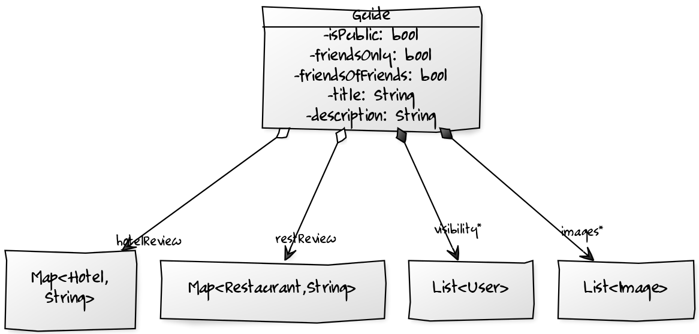

**Fig.1.1 High coupled `Guide` class**

Before we analyse this design: Can you identify some poor design decisions? Try to name a few of them before you read any further.

The problems with this design are:

* assuming that `Image` is a class, this design couples images with a guide, but the guide should display images personalised to each viewer! (See section Case study),
* the visibility attribute maintains a list of users that can read the guide; this solution does not scale when there are many users. The same field may be used for different visibility settings, which makes the logic more difficult to test and understand, since the attribute has different meaning based on other properties,
* the use of multiple, non-overlapping, booleans makes the code difficult to follow as you will introduce branches and its related logic in each case,
* hotels, restaurants and others should implement a common interface, si that you can dispatch polymorphously. If you don't do this, adding a few new places, e.g. `SushiBar` class, implies the creation of more attributes and respective methods to get those elements,
* the constructor receives an `ArrayList`, which binds an implementation detail to the list abstraction.

So, given this poor design (Fig 1.1, Listing 1.1), how could we reduce coupling a `Guide` to other elements? The most obvious alternative would be to put less responsibilities in the `Guide`. This reduces coupling to other elements and, as a side effect, keeps the class focus on what it should do, i.e., the class is easy to understand, test, and maintain.

 For example, a `Guide` does not need to be concerned about its visibility and we can group different places (restaurants, hotels, bars, etc) contained in a guide under the idea of a point of interest (Fig. 1.2). These two changes reduce the responsibilities of the `Guide` class, thus reducing coupling (Listing 1.2).

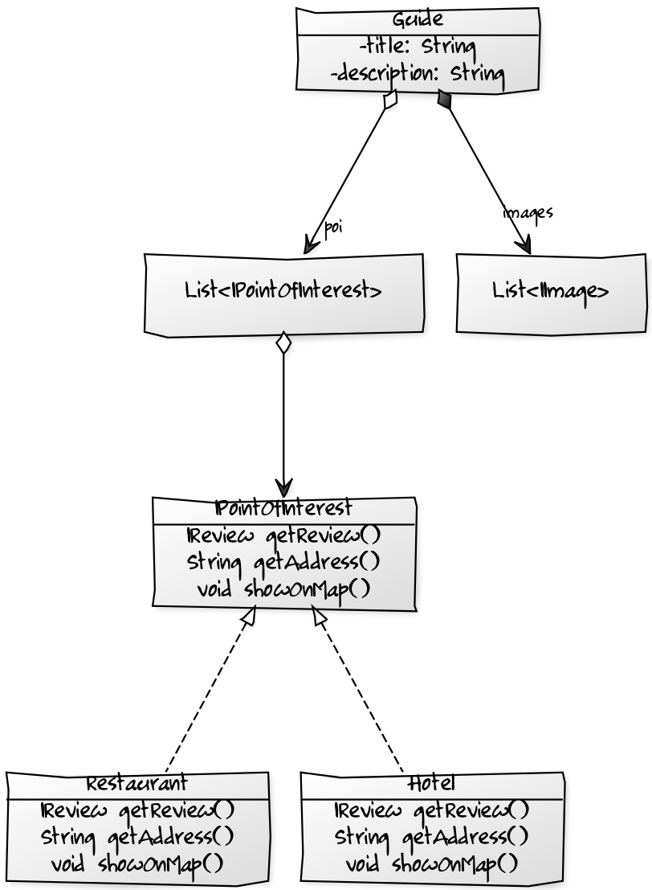

**Fig. 1.2 Loosely coupled `Guide` class**

```java
public class Guide {
  private List<IImage> images;
  private String title;
  private String description;
  private List<IPointOfInterest> poi;

  public Guide(ArrayList<IImage> images,
                          String title,
                          String description){
    \\ Initialise method
    ...
  }
}

public interface IPointOfInterest {
  public IReview getReview();
  public String getAddress();
  public void showOnMap();
  ...
}
```

**Listing 1.2 Loosely coupled `Guide` class**

**Exercise**: Given the refactoring above, how does a guide deal with its visibility?

**Exercise**: Why should we promote interfaces over inheritance?

**Exercise**: Does it make sense that the class`Hotel` declares methods that do not exist in the interface `IPointOfInterest`? (Note:  you may need to read the section on polymorphism)

<!--

(Solution: we are coupling to an interface but, interfaces do not expose their implementation, so this coupling is much weaker than a direct class. Furthermore, we use interfaces in instability points. For example, the CEO may add a sushi restaurant as a point of interest and, because you know that in early stages of development things change, try to create a design as loosely coupled add possible)

-->

## High Cohesion

Cohesion refers to keeping the responsibilities of the class focused. A cohesive class does one thing and does it well. Highly cohesive code is focused and, as side effect, doesn't talk to too many objects.

Often, you'll see code that contains many methods, attributes, and a lot of logic and magic. This code builds the antipattern known as "The Blob",  which results in high coupled code with low cohesion, e.g. Fig. 1.3.1.

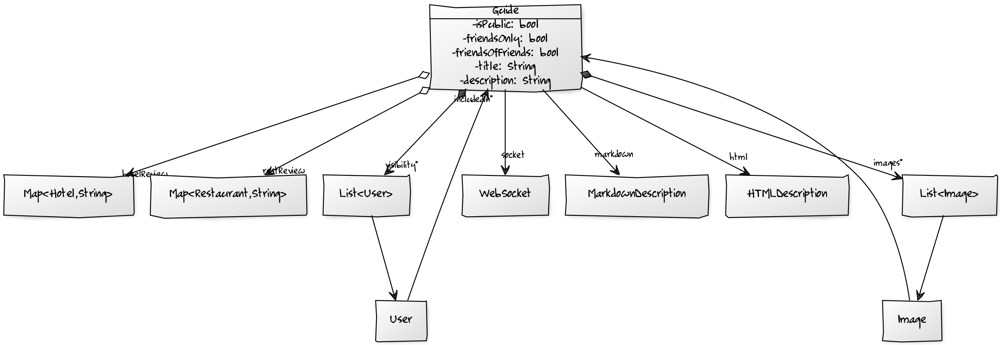

**Fig. 1.3.1 "The Blob", a class that swallows everything**

This example (Listing 1.1 or Fig. 1.3.1) shows the `Guide` class, which exhibits multiple responsibilities, such as keeping the data of the class, managing its visibility and each possible point of interest, individually. Listing 1.2 shows a more cohesive code, where the guide is responsible for handling its content. This change keeps the class focus on what it does and it's easier to understand because the class doesn't mix different responsibilities.

Whenever you need to evaluate a design, a high cohesive code exhibits the following properties:

- code doesn't mix responsibilities,
- has few methods,
- doesn't talk too many objects.

**Dependence relationship**:

*Coupling* and *cohesion* usually go hand in hand, since code with low cohesion is code that does too many things, hence it relies on too many objects.

One way to look at it is to understand coupling as the relation between subsystems (modules and packages) and cohesion as the relation within a subsystem. As we argued before, Listing 1.1 is highly coupled and exhibits low cohesion.

Lets look at another example that shows that these two concepts usually go hand in hand:

```java
public class Review {
  private String comment;
  private User author;
  private Image image;
  private List<User> friendsToNotify;

  public class Review (User author,
                            String comment,
                            Image image,
                            List<User> notification){
    this.author = author;
    this.comment =comment;
    this.image = image;
    this.friendsToNotify = notification;
  }

  // Getters and setters
  ...

  public Image show() {
    this.image;
  }
}
```

**Listing 1.3.2 `Review` class**

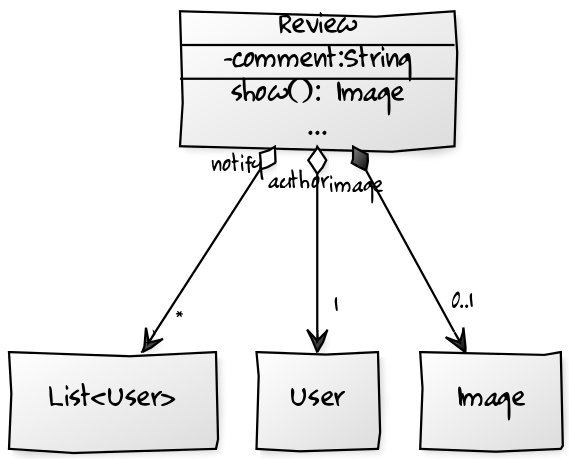

**Fig. 1.3.2  `Review` class diagram**

The code in Listing 1.3.2 is highly coupled for its small size and exhibits low cohesion:

* this class mixes the behaviour of a review with the behaviour of some other class that should send notifications (see *Observer* pattern)
* this class is coupled to the notification engine and to the `Image` class. The consequences of coupling to an image means that, either every review has an image or your code will now have to branch when the user does not supply an image. This branching checks if `image == null`, which is performed at runtime - slower code - and an antipattern (REFERENCE HERE, use instead the *Null Object* pattern or an [option type](https://docs.oracle.com/javase/8/docs/api/java/util/Optional.html)).
* Coupling to an image also means that you can no longer post a video review. Throwing a quick `video` attribute does not solve the problem, as the `show()` method returns an `Image` and, every caller of the`Review` class will have to explicitly handle showing an image or a video. Thus, the code becomes more complex and difficult to maintain.

We improve this current design by:

* setting a comment to be anything that implements the interface `IComment`. This allows us to define new classes, e.g. `VideoComment` as long as it implements the methods of the interface.
* the `Image` class has been updated to an `IDisplayable` which...
If we refactor this code, it ends up as Listing 1.3.3, Fig. 1.3.3.

```java
public class Review {
  private IComment comment;
  private User author;
  private List<Displayable> attachments;
  private List<INotifier> listeners;

  public class Review (User author,
                            IComment comment,
                            List<IDisplayable> attachments,
                            List<INotifier> notification){
    this.author = author;
    this.comment = comment;
    this.attachments = attachments;
    this.listeners = notification;
  }

  // Getters and setters
  ...

  public List<Displayable> show() {
    return this.attachments;
  }
}
```

**Listing 1.3.3 Refactored `Review` class**

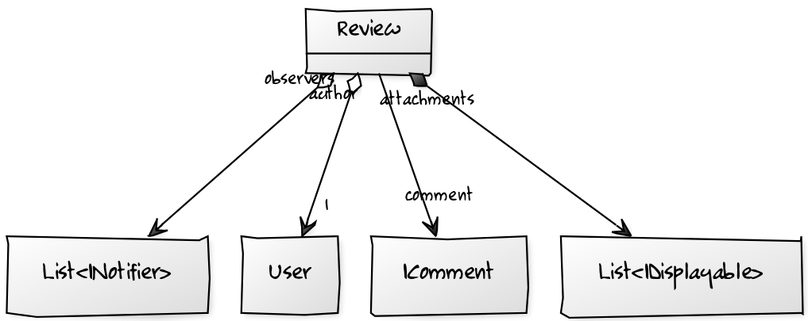

**Fig. 1.3.3 Refactored `Review` class**

**Exercise**: Given the code in Listing 1.3.2, add the following functionality:

* export the comment to markdown
* export the comment to HTML
* notify interested users
* create a `Company` class that should be notified of changes

*Reflection*:

* How many classes did you change?
* Does it seem like such a design is flexible and easy to refactor?

**Exercise**:
Given the code in Listing 1.3.3, add the following functionality:

* export the comment to markdown
* export the comment to HTML
* notify interested users
* create a `Company` class that should be notified of changes

*Reflection*: Does it seem like this design is flexible and easy to refactor?

## Creator

This principle is likely overlooked but it plays a crucial role in object-oriented programming; the creator *establishes who is responsible* for creating an object. If you defined it well, your code will exhibit loose coupling and high cohesion; err an you will begin your journey to maintaining spaghetti code.


A class `X` is the creator of an object `Y` if any of the following statements are satisfied:

- class `X` initialises object `Y`
- class `X` contains object `Y`
- class `X` closely uses and depends on class `Y`

Lets see this with an example: in the case study we have hotels, restaurants, bars, museums, etc. As a user of the application, I would like to write comments, place pictures, videos of my experience in such places and give a rating. Based on this idea, who are the creators of the following classes:

* `Hotel` class,
* `Restaurant` class,
* `Comment` class,
* `Rating` class, and
* `Image` class

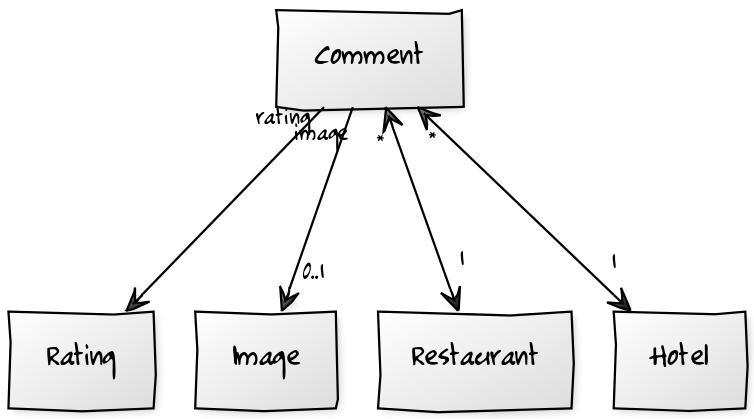

**Fig. 1.4 Relation between comments, hotels, images, and ratings**

The `Hotel` and `Restaurant` are usually created by a user, who has to fill out some details regarding these classes. This does not mean that a`User` class creates the guides, they are probably created by a controller (see the Controller principle in this chapter). The `Comment` class could be created by another controller or by a specific class such as `Hotel` and `Restaurant` (depends on the level of abstraction and design patterns used, Part III of this book). A comment has associated with it a rating of the place, for fast visual aid, and an image and should be the creator of `Image` and `Rating` classes.

Lets introduce an exercise to show the implications of the creator principle: *a point of interest* groups hotels, restaurants, etc, under the same category, base class, `POI` that all points of interests need to inherit from. Based on the example from above,  a user can place comments in points of interest, hence POI is the creator of instances `Comment`.

**Exercise**: What kind of benefits and drawbacks do you get if `POI` is not the creator of the comments?

<!--

**Solution**: (in solutions chapter) if comments are always the same, just text, then it makes sense that `POI`is the creator. However, what if I want to support multiple kinds of comments, i.e. video comments, text, or images as à comment? In that case, you are better off injecting the comments as an extra argument to the POI object. - does this makes sense? POI is always created first and comments are added later on, it's not an initialiser but a method that adds comments.

-->

## Information Expert

Classes have methods that define their responsibility and behaviour. A class exposes its behaviour via methods and its internals should always be opaque. With this basic idea, this principle helps you to identify the behaviour of each class.

A class is responsible for a behaviour if that class contains all the information to carry it out. For example, which class should be responsible for updating the description of a guide?

a. `User` class

b. `POI` (point of interest) class

c. `LatitudeLongitude` class

d. `Guide` class

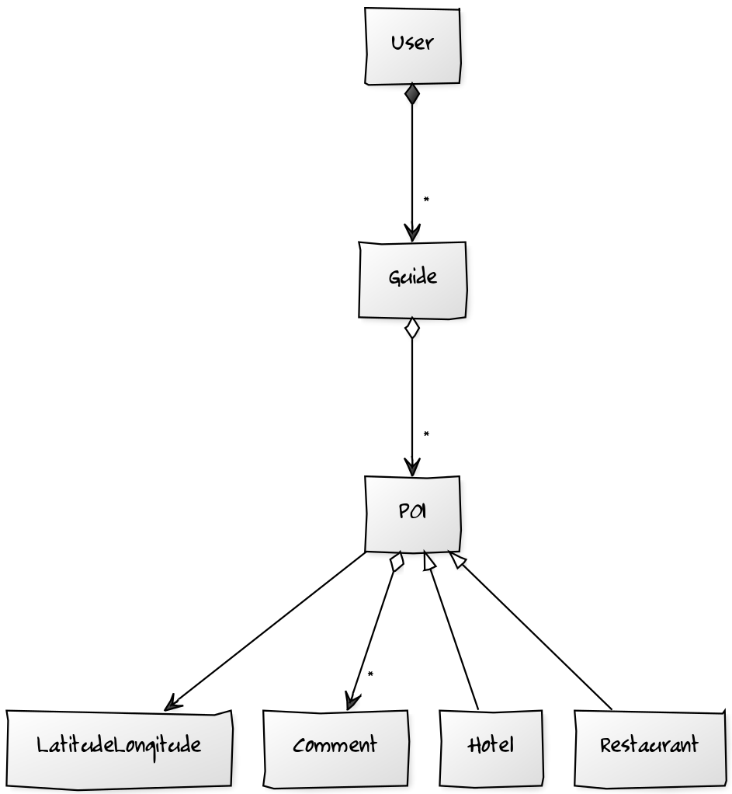

**Fig. 1.5 Relation between users, guides, point of interest, and comments**


This one is easy. Lets consider each option:

a. If we update the guide description via `this.user.setGuideDescription(newDescription)` it implies that each user has a single guide, otherwise we would not know which guide we are updating. It could also mean that each user may be uniquely identified by its email and its guide. This is a really bad design from the relational point of view, database-wise. When representing the data layer from a NoSQL database this is allowed and I have seen it in use. I do not think this is a good model since, in the database, each record with the the same email is treated independently.

b. A point of interest, such as a view, may be linked to multiple guides. For this reason, similar to above, such a design is non-maintainable.

c. This really does not make sense.

d. We have a winner! The guide instance has all the information to update the guide.

The information expert assigns responsibilities to the classes that have all the information to fulfill the action.

**Exercise**: A user wants to submit a few pictures with a review of her favourite restaurant in Málaga, Spain. Which of the following classes should be the information expert and provide that behaviour? Why?

a. `User` object

b. `Guide` object

c. `Review` object

## Controller

Most applications have a user interface (UI), which limits the actions that users can take. The user interface needs to communicate to other layers of your software. This principle tell us which object receives and handles events / actions coming from the UI. For example, a mobile application talks to the server via a [REST API](https://en.wikipedia.org/wiki/Representational_state_transfer), i.e. whenever the user clicks on an icon on the phone, the mobile application sends a packet to your server, which responds with the requested information. Using this principle, you can decouple the user interface from the class that takes action on the event.

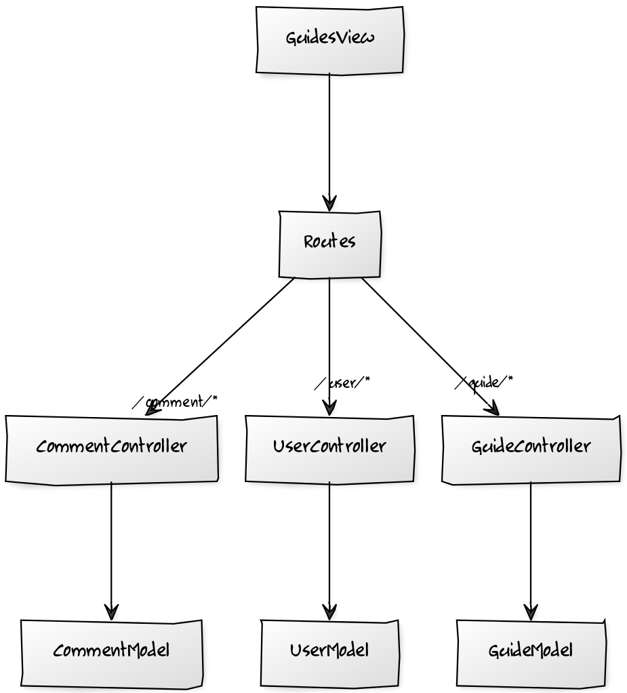

**Fig. 1.6 Controller**

The example in Fig. 1.6 represents the most common pattern in web frameworks, Model-View-Controller (*MVC*). The `GuideView` is decoupled from its model (`GuideModel`), which is the class in charge of business logic, including saving and retrieving guides from a database . This design pattern, *MVC*, is explained in further chapters.

**Exercise** What does the class `Routes` represent in the example?

## Polymorphism

This principle is one of the most important ones in object-oriented programming and the one that makes OOP great at dividing responsibilities between classes.

As we saw in the recap section, this polymorphism refers to classes that implement an interface or inherit from a top class but, not to parametric classes.

<!-- which is also polymorphic on the (opaque or bounded) type variable.-->

This principle allows classes to specify the same responsibilities via an interface but decouples the behaviour for each type. For instance, in our application, we want to show a special logo on top of the pictures of famous users who have confirmed their identity. A valid design, that does not scale, has a single `User` class with an attribute named `confirmedIdentity`  which sets the flag to true when the user has confirmed its identity. This design works for two kind of users, the normal and confirmed users. Tomorrow, Johan (CEO) wants to add a new kind of user who represents a company; companies cannot create accounts, their identity is always confirmed (the cannot exist companies where the identity is not confirmed, and multiple employees from the company want to sign in using different password, one per employee. Creating a company's profile as a confirmed user seems wrong and error prone, it makes no sense the attribute `confirmedIdentity` for a company's profile because we know that this will always be true. The reuse of a confirmed user as a company leaves dangling the possibility of programming mistakes where a company could be created but without a confirmed identity. The current code before the companies profiles were added are in Listing 1.7.1, Fig. 1.7.1.

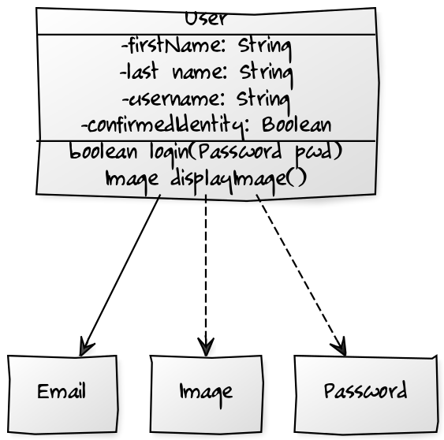

**Fig. 1.7.1 `User` code before existence of companies profiles**

```java
public class User {
  private String firstName;
  private String lastName;
  private boolean confirmedIdentity;
  private String username;
  private Email email;

  // Getters and setters
  ...

  public boolean login(Password pwd) {
    ...
  }

  public Image displayImage() {
    if (this.confirmedIdentity) {
      return Badge.getConfirmedImage();
    } else {
      return Badge.getDefaultImage();
    }
  }
}
```

**Listing 1.7.1. `User` code before existence of companies profiles**

Another design could represent different users using an enum attribute. Based on this value, the `displayImage()` method adds logic to check which kind of user you are and how to display the image. You go home thinking that this is a good design, all the logic is kept in a single method.

The problem with this approach, quite often used by beginners or as a shortcut, is that you are encoding different classes in a single one. This design is not maintainable in the long run because the same class encodes behaviour for different objects (users). Your design is abstracting at the wrong level.

A better approach is to create a class for each kind of user and dispatch dynamically. This design is easier to maintain because the behaviour is not encoded solely on the method, but on the type. The Listing 1.7.2. shows how to dynamically dispatch based on the type.

```java
public class User {
  private String firstName;
  private String lastName;
  private boolean confirmedIdentity;
  private String username;
  private Email email;

  // Getters and setters
  ...

  public boolean login(Password pwd) {
    ...
  }

  public Image displayImage() {
    return Badge.getDefaultImage();
  }
}

public class ConfirmedUser
   extends User {

  public Image displayImage() {
    return Badge.getConfirmedImage();
  }
}
```

**Listing 1.7.2. Dynamic dispatch of users**

**Exercise** Add the following items:

* Add a user for companies
* Implement the `login(Password pwd)` method for default and confirmed users
* Implement the `login(Password pwd)` method for companies

**Exercise** Write the main class and show that the method performs a dynamic dispatch based on the classes.

**Exercise** The code given above (Listing 1.7.2) users inheritance. Implement the same functionality using interfaces. What are the benefits and drawbacks of this design and implementation decisions?

<!--

(Note: this is distinct for Python because there's no interface etc. Think how would you explain it in python)

Python is a dynamic language with strong typing. This means the language assigns types at runtime, but you as a developer won't get any type error at compilation time. In Python polymorphism is always given and you as developer are in charge of ending that the methods you call exist or you will get a runtime error. As we said, the are no interfaces that we are bound to and python supports what's called duck typing, which is an idea much closer to how things work in real life. Let me show this with an example: you can read articles, news, cereal boxes and anything that has text. In Java you are bound by the type of object you are but in Python you are bound to the behaviour you have. A method call on `newspaper. hasText()` and `cerealBox.hasText()` works in Python independent from their type; Java would make this work only when they belong to the sand type or interface. For this reason, Python is more expressive in this regard, although it sacrifices static typing guarantees and forces the developer to either handle exceptions or crash and burn at runtime if the object on which the program calls the method `hasText()` does not provide such behaviour.

**Exercise** write the code depicted on Figure Yyy in Python. Do not forget to handle exceptional cases.

**Exercise** Write the main class and show that the method performs a dynamic dispatch based on the classes.

-->

## Indirection

Domain objects may end up being coupled to other objects in the first iteration of your design. This principle states that you should create an intermediate object that mediates between these two, hence reducing coupling.

To the untrained eye, after applying the principle, it may seem as if two objects that were coupled are still coupled but to an intermediary object. This is right, except that this indirection breaks the idea of one object having a direct relation to the other one. The layer in between breaks the coupling directionality, and creates a more flexible design, since the two initially coupled objects do not need to know anything about each other anymore. Lets out this principle in perspective with an example and an analysis of the solutions prior to the introduction of this principle.

*A guide can be seen by multiple friends and each of your friends may see a different cover image.*

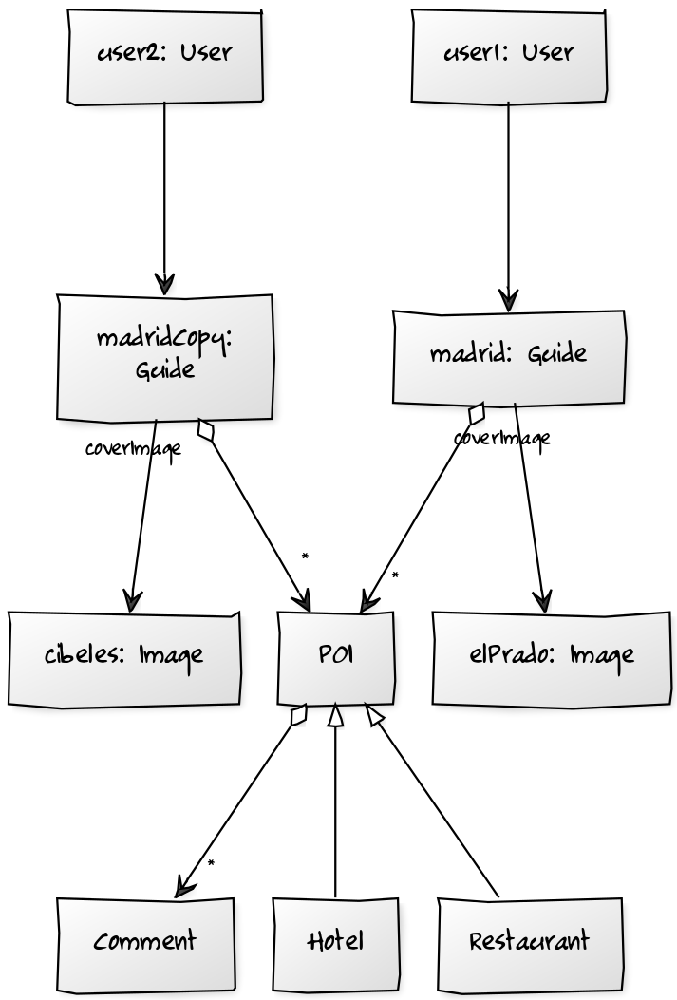

**Fig. 1.8.1 Duplication of guides**

A poor strawman's solution duplicates the guide for each friend and recalculates the cover image for each friend. This is a really bad design, as it's redundant, consumes memory, and duplicates data. Moreover, an update on one guide's description involves updating all copies of that guide.

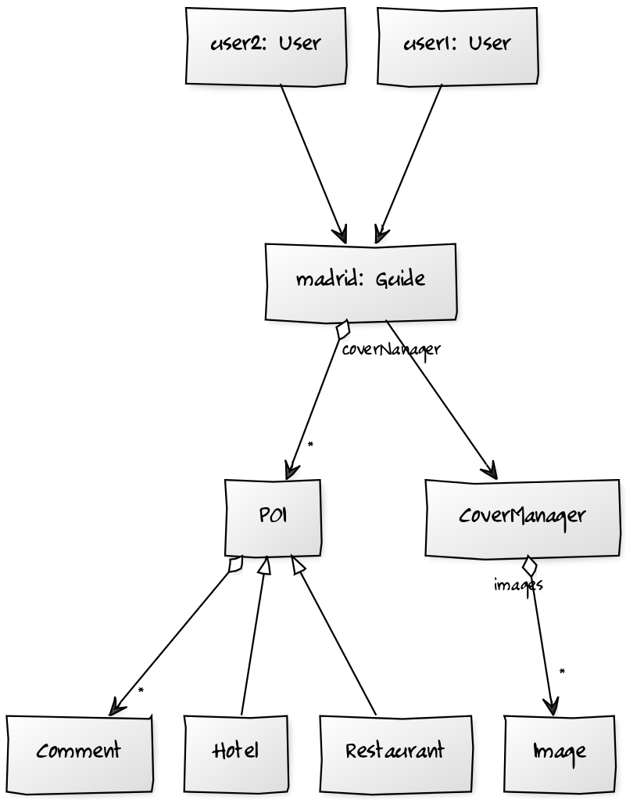

**Fig. 1.8.2 Example after application of indirection principle**

A better solution, applying this principle, is to add a new level of indirection between a guide and its cover image, named `CoverManager` (Fig. 1.8.2). The `CoverManager` knows how to retrieve the best cover image for the calling object. Internally, the manager may have to call the AI algorithm from time to time to update the image, cache it if the same user keeps coming to the same guide, and even persist in the database this mapping of guide-cover image.

<!--

An example of this pattern (Figure zzz) is the indirection introduced between the images and the guides. The idea here is that the same guide is shared among friends, and each of your friends may potentially see a different cover image. Prior to this principle, your initial solution was to duplicate the guide for each friend and recalculate the cover image for each of them. This solution is redundant, consumes memory, and duplicates data, so an update on one description involves updating all data in all copies of the guide. A better solution is to add a new level of indirection between a guide and its cover image, 'CoverManager`, that knows how to retrieve the best cover image for the calling object. Internally, the manager may have to call the AI algorithm from time to time to update the image, cache it if the same user keeps coming to the same guide and even persist this mapping of guide-cover image in the database if the cover image doesn't change that often.

(Figure zzz)

-->

**Exercise** Following the principles of these chapter, how would you design data persistence of an object from the case study? That is, would you add CRUD (Create, Read, Update and Delete) methods to all domain objects, e.g. your `Guide` class? If so, how would you avoid the coupling introduced by this design?

**Exercise** How would you design the offline mode of your application? That is, how do you deal with low connectivity or no connectivity at all?

<!--

Solution: you never assume that there is a connection and instead create an intermediate layer that handles the communication. If the server is unreachable, this layer handles how to proceed. An advanced design pattern that users this idea is the circuit breaker (explained in later chapters)

-->

## Pure Fabrication

The term "pure fabrication" means to make something up. You should use this principle whenever you observe that your domain classes are getting too overloaded, i.e., the start to exhibit high coupling and low cohesion.

The principle adds a new indirection between two domain objects that would otherwise be directly connected (coupled). The indirection means adding a new object that mediates the communication between two other entities. This mediator is not part of the domain, that is, it is a software concept. Examples of this principle are: object pools, database classes, and pretty much any class that sits in between two domain objects. This principle is quite common in the adapter pattern (Fig. 1.9)


**Fig. 1.9 Adapter pattern using pure fabrication**

In this example (Fig. 1.9), the `PaymentAdapter` has an overloaded constructor, taking either a `Paypal` or a `CreditCard` object. A user that calls on the `pay` method does *not* need to know whether this class, `PaymentAdapter` does the payment using a credit card or a paypal account, the implementation of the adapter solves this issue.

**Exercise**:Where could this principle be applied in the case study? Why? (There are many valid examples)
**Exercise**: What happens if you add 6 different payment methods? (What are the drawbacks, if any?)

<!--

Solution: the AI algorithm that inject images to guides. If this was not there, every guide would have the same image for all guides, tying the guide to the images. With the algorithm, the same guide share with friends shows different images based on other friends and connections.

-->

**Exercise**: Lets assume that you would like to get a phone notification whenever a friend posts a new comment on one of her guides. What classes would you need to create?  What classes are a pure fabrication?

<!--

Solution: at the very least, you would need a `Notification` class that contains the text and image of the notification and some kind of notification manager that schedules and send notifications to the appropriate parties.

-->

## Protected Variation

<!--

This principle is easy to apply and, in practice, requires you to be good at forecasting future pivot points or changes of direction.

-->

The core idea of this principle is to shield your code in places where you expect changes, let that be via interfaces or other means. For example, from the case study, if we were to provide special guides that users can buy, we would need to integrate with a payment platform. If you are not sure which one is best, you'll end up picking one that seems good enough, and call their methods where necessary. However, what happens when CEO Johan finds out that there is a new platform that has lower commissions? He wants you to change to this better option. Refactoring may not be so easy because both payment solutions have different libraries with different APIs. Now, you need to change all those specific method calls from the old library to the new library, possibly including changes in the workflow.


**Fig. 1.10 Example of protected variation principle**

One way of solving this problem is via an interface (`IPayment`) and different classes that implement those methods (Fig. 1.10). In this design, you are protecting yourself from future changes. Your concrete classes, the ones implementing the interface (`PaypalAdapter` and `StripeAdapter`), work out of the box. This means that, adding a new payment method, e.g. `ApplePay`, should be as simple as creating a class that implements the interface and hides the details of the concrete method calls of `ApplePay`.

You should apply this pattern in instability points (classes) and, specially, when using third party libraries that you don't have previous experience with.

## Pure functions

This principle is not part of the common and well known GRASP principles but, in my experience, you should consider it. Lambdas, closures and pure functions are ubiquitous nowadays. My advice is that you stop using closures that captures mutable state. The main reason is that, at one point or another, you'll benchmark your application and start using parallel capabilities of your computer: task, futures, actors or whatever is the next parallel abstraction. If you encapsulate mutable state in closures, you are building your own coffin for the not so far away future. Things like processing an recognitive computation cannot be used anymore if the object the closure captures is shared between two threads -- unless you can guarantee data race freedom. Data race freedom code is hard to write, maintain and make fast, so using locks may get you out of troubles at the cost of losing horizontal scalability [^1].

[^1]: TODO: Explain horizontal scalability
